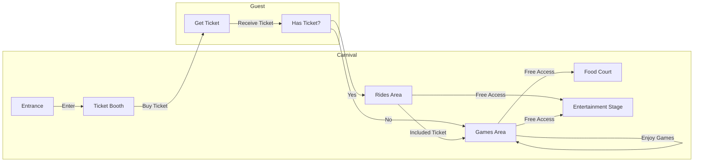

```mermaid
graph LR
    subgraph Carnival
        A[Entrance]
        B[Ticket Booth]
        C[Rides Area]
        D[Games Area]
        E[Food Court]
        F[Entertainment Stage]
    end

    subgraph Guest
        G[Get Ticket]
        H[Has Ticket?]
    end

    A -->|Enter| B
    B -->|Buy Ticket| G
    G -->|Receive Ticket| H

    H -- Yes --> C
    H -- No --> D

    C -->|Included Ticket| D

    D -->|Enjoy Games| D


    D -->|Free Access| E

    C -->|Free Access| F
    D -->|Free Access| F
```