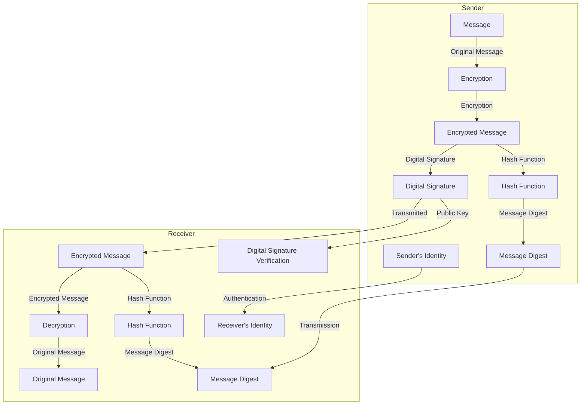

```mermaid
graph TD
    subgraph Sender
        A[Message]
        B[Encryption]
        C[Encrypted Message]
        G[Sender's Identity]
        I[Hash Function]
        J[Message Digest]
        M[Digital Signature]
    end

    subgraph Receiver
        D[Encrypted Message]
        E[Decryption]
        F[Original Message]
        H[Receiver's Identity]
        K[Hash Function]
        L[Message Digest]
        N[Digital Signature Verification]
    end

    A -->|Original Message| B
    B -->|Encryption| C
    C -->|Digital Signature| M
    M -->|Transmitted| D
    D -->|Encrypted Message| E
    E -->|Original Message| F

    G -->|Authentication| H
    C -->|Hash Function| I
    I -->|Message Digest| J
    D -->|Hash Function| K
    K -->|Message Digest| L
    J -->|Transmission| L
    M -->|Public Key| N
```