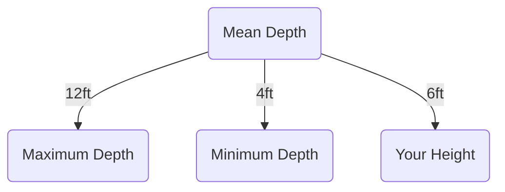
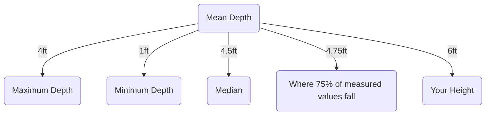

# Crossing the River Dilemma

---

## The Scenario

Imagine finding yourself on one side of a muddy river, with no bridges or boats, unable to swim. The only information available is a sign indicating the mean depth of the river is 4 feet 

---

## Understanding Mean Depth

The mean depth is calculated by averaging the depths at each square-foot area. It's the sum of all depths divided by the number of measurements.

Now, let's consider your height: 6 feet. Does Figure  provide enough information for you to attempt to cross the river by walking?

---

## Decision Point

- **Yes:** This implies confidence in the mean depth of 4 feet as a safe crossing.

- **No:** The fear arises from the uncertainty of not knowing variations in depth.

---

## Additional Information

Suppose the sign also mentions:
- **Maximum Depth:** 12 feet
- **Minimum Depth:** 1 foot 

This additional information might change your perspective.

---

## Maximum Depth Concerns

The maximum depth is the largest measured value. Knowing it's 12 feet might cause concern. Is this depth at one point or multiple points? Uncertainty lingers.

---

## Minimum Depth Encouragement

The minimum depth, 1 foot, seems encouraging. However, similar to the maximum depth, you lack information on whether it's at one point or multiple points.

---

## In Conclusion

With this added information, the decision to cross becomes more complex. The balance between courage and risk now involves considerations of variability in depths at specific points.

Remember, it's not just about the mean, but the extremes - maximum and minimum depths.

---

# Conclusion

The decision to cross the river is multifaceted. Analyzing the statistical measures and understanding the depth variability are crucial in evaluating the risks associated with the crossing.

---

# Thank You!
